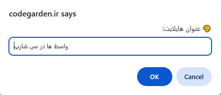
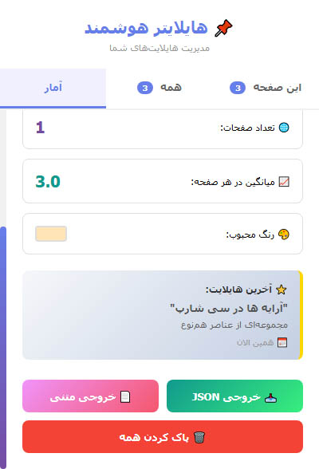

<div align="center">

# 🎨 Web Highlighter Extension

### ✨ Highlight, Save, and Organize Text Across the Web

[](https://github.com/yourusername/web-highlighter-extension)
[](https://github.com/yourusername/web-highlighter-extension)
[](LICENSE)
[](https://github.com/yourusername/web-highlighter-extension/releases)


**A powerful Chrome extension to highlight and save important text on any website**

[Features](#-features) • [Installation](#-installation) • [Usage](#-usage) • [Screenshots](#-screenshots) • [Contributing](#-contributing)

</div>

---
## 📸 Screenshots
<p align=center>Highlighting a Text</p>
<div align="center">

 <p align=center>Add a title to selected</p>

 <p align=center>View all titles</p>

  <p align=center>Reports</p>

</div>


## ✨ Features

<table>
<tr>
<td width="50%">

### 🎯 Core Features
- 📌 **Easy Highlighting**: Select text and click to highlight
- 💾 **Auto Save**: Highlights saved automatically
- 🔄 **Auto Restore**: Highlights restored on page revisit
- 🏷️ **Custom Titles**: Add meaningful titles to highlights
- 🎨 **Colorful**: 8 beautiful random colors
- 🗑️ **Easy Delete**: Right-click to remove highlights

</td>
<td width="50%">

### 🚀 Advanced Features
- 💡 **Smart Tooltips**: Hover to see highlight titles
- 🎭 **Beautiful UI**: Gradient buttons with animations
- ⚡ **Fast Performance**: Optimized for speed
- 🔒 **Privacy First**: All data stored locally
- 🌐 **Works Everywhere**: Compatible with all websites
- 🛡️ **Error Handling**: Robust context invalidation handling

</td>
</tr>
</table>

---

## 🚀 Installation

### Method 1: From Source (Recommended)

```bash
# Clone the repository
git clone https://github.com/serajcomputerarts/web-highlighter-extension.git

# Navigate to the directory
cd web-highlighter-extension
